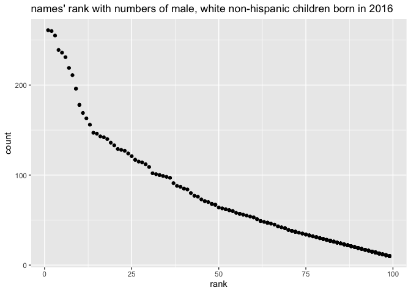

This is a R MARKDOWN file for homework 2.

## Problem 1 read and clean the Mr. Trash Wheel dataset.

``` r
#read and clean Mr. Trash Wheel dataset
trashwheel_df = 
  read_excel("./hw_data/Trash-Wheel-Collection-Totals-7-2021-sept.xlsx", range = "A2:N574") %>% 
  janitor::clean_names() %>% 
  drop_na(dumpster) %>%  # omit rows that don't include dumpster data
  mutate(sports_balls = as.integer(sports_balls))  #round to the nearest integer

# read and clean the precipitation data
precipitation_2018_df =
  read_excel("./hw_data/Trash-Wheel-Collection-Totals-7-2021-sept.xlsx", sheet = "2018 Precipitation", range = "A2:B14") %>%
  janitor::clean_names() %>%
  drop_na(total) %>%  # omit rows that don't include data
  mutate(year = 2018) %>%  # add a 'year' variable
  relocate(year)

precipitation_2019_df = 
  read_excel("./hw_data/Trash-Wheel-Collection-Totals-7-2021-sept.xlsx", sheet = "2019 Precipitation", range = "A2:B14") %>%
  janitor::clean_names() %>%
  drop_na(total) %>%  # omit rows that don't include data
  mutate(year = 2019) %>%  # add a 'year' variable
  relocate(year)

# combine two datasets
precipitation_com_df = 
  bind_rows(precipitation_2018_df, precipitation_2019_df) %>% 
  mutate(month = month.name[month])  # convert month to a character variable
```

The number of observation in trashwheel\_df dataset is 486, and the key
variables are: dumpster, month, year, date, weight\_tons,
volume\_cubic\_yards, plastic\_bottles, polystyrene, cigarette\_butts,
glass\_bottles, grocery\_bags, chip\_bags, sports\_balls, homes\_powered

The number of observation in precipitation\_com\_df dataset is 24. The
key variables are: year, month, total

The total precipitation in 2018 is 70.33.

The median number of sports balls in a dumpster in 2019 is 9.

## Problem 2

``` r
# read and clean the pols_month.csv data
pols_month_df = 
  read_csv("./hw_data/pols-month.csv") %>% 
  janitor::clean_names() %>%
  separate(mon, into = c("year", "month", "day")) %>%  # break up the variable 'mon' 
  mutate(year = as.integer(year), month = as.integer(month), day = as.integer(day)) %>%  # transfer the variables to integer
  mutate(month = month.name[month]) %>%  # use month name in table
  mutate(president = prez_dem) %>%  # create a 'president' variable
  mutate(president = recode(president, "0" = "gop", "1" = "dem"))  # take values for variable
```

    ## Rows: 822 Columns: 9

    ## ── Column specification ────────────────────────────────────────────────────────
    ## Delimiter: ","
    ## dbl  (8): prez_gop, gov_gop, sen_gop, rep_gop, prez_dem, gov_dem, sen_dem, r...
    ## date (1): mon

    ## 
    ## ℹ Use `spec()` to retrieve the full column specification for this data.
    ## ℹ Specify the column types or set `show_col_types = FALSE` to quiet this message.

``` r
pols_month_df = select(pols_month_df, -day, -prez_dem, -prez_gop)  # remove three variables
```

## Clean the data in snp.csv

``` r
snp_df =
  read_csv("./hw_data/snp.csv") %>%
  janitor::clean_names() %>%
  mutate(date = parse_datetime(date, "%m/%d/%y")) %>% # figure out date in another formula
  mutate(date = as.Date(ifelse(date > Sys.Date(), format(date, "19%y-%m-%d"), format(date)))) %>%  # correct wrong 'year' numbers
  separate(date, into = c("year", "month", "day")) %>% 
  mutate(year = as.integer(year), month = as.integer(month), day = as.integer(day)) %>% 
  arrange(year, month) %>%  # arrange according to year and month
  mutate(month = month.name[month]) 
```

    ## Rows: 787 Columns: 2

    ## ── Column specification ────────────────────────────────────────────────────────
    ## Delimiter: ","
    ## chr (1): date
    ## dbl (1): close

    ## 
    ## ℹ Use `spec()` to retrieve the full column specification for this data.
    ## ℹ Specify the column types or set `show_col_types = FALSE` to quiet this message.

``` r
snp_df = select(snp_df, -day) %>%  # remove one variable
  relocate(year)
```

## Tide the unemployment data.

``` r
unemployment_df = 
  read_csv("./hw_data/unemployment.csv") %>% 
  janitor::clean_names() %>% 
  rename(
    January = jan,
    Febrary = feb,
    March = mar,
    April = apr,
    May = may,
    June = jun,
    July = jul,
    Augest = aug,
    September = sep,
    October = oct,
    November = nov,
    December = dec
  ) %>%  # rename variables
  pivot_longer(
    January:December,
    names_to = "month",
    values_to = "percentage of unemployment"
  )  # tidy the data to have the same variable with above two datasets
```

    ## Rows: 68 Columns: 13

    ## ── Column specification ────────────────────────────────────────────────────────
    ## Delimiter: ","
    ## dbl (13): Year, Jan, Feb, Mar, Apr, May, Jun, Jul, Aug, Sep, Oct, Nov, Dec

    ## 
    ## ℹ Use `spec()` to retrieve the full column specification for this data.
    ## ℹ Specify the column types or set `show_col_types = FALSE` to quiet this message.

## Join the three dataset above.

``` r
join_two_df = left_join(pols_month_df, snp_df, by = c("year" = "year", "month" = "month")) 
join_df = left_join(join_two_df, unemployment_df, by = c("year" = "year", "month" = "month"))
```

The dataset of “pols\_month\_df” contains 9 variables:year, month,
gov\_gop, sen\_gop, rep\_gop, gov\_dem, sen\_dem, rep\_dem, president
and 822 observations with a range from 1947-2015.

The dataset of “snp\_df” contains 3 variables:year, month, close and 787
observations with a range from 1950-2015.

The dataset of “unemployment\_df” contains 3 variables:year, month,
percentage of unemployment and 816 observations with a range from
1948-2015.

The resulting dataset “join\_df” contains variables year, month,
gov\_gop, sen\_gop, rep\_gop, gov\_dem, sen\_dem, rep\_dem, president,
close, percentage of unemployment and 822 observations from 1947-2015.

## Problem 3

``` r
popl_babynames_df =
  read_csv("./hw_data/Popular_Baby_Names.csv") %>% 
  janitor::clean_names() %>%
  mutate(childs_first_name = toupper(childs_first_name)) %>%  # unify the data format
  mutate(ethnicity = tolower(ethnicity)) %>% 
  mutate(gender = tolower(gender)) %>% 
  mutate(ethnicity = replace(ethnicity, ethnicity == "asian and paci", "asian and pacific islander")) %>% 
  mutate(ethnicity = replace(ethnicity, ethnicity == "black non hisp", "black non hispanic")) %>%
  mutate(ethnicity = replace(ethnicity, ethnicity == "white non hisp", "white non hispanic")) %>%
  distinct() # remove the duplicated rows
```

    ## Rows: 19418 Columns: 6

    ## ── Column specification ────────────────────────────────────────────────────────
    ## Delimiter: ","
    ## chr (3): Gender, Ethnicity, Child's First Name
    ## dbl (3): Year of Birth, Count, Rank

    ## 
    ## ℹ Use `spec()` to retrieve the full column specification for this data.
    ## ℹ Specify the column types or set `show_col_types = FALSE` to quiet this message.

``` r
# create a table that shows the rank of the female name "Olivia"
olivia_popl_df =
  filter(popl_babynames_df, 
         gender == "female",
         childs_first_name == "OLIVIA"
         ) %>% 
  arrange(year_of_birth) %>% 
  rename(
    "year of birth" = year_of_birth,
    "childs first name" = childs_first_name
  )
knitr::kable(olivia_popl_df)
```

| year of birth | gender | ethnicity                  | childs first name | count | rank |
|--------------:|:-------|:---------------------------|:------------------|------:|-----:|
|          2011 | female | asian and pacific islander | OLIVIA            |    89 |    4 |
|          2011 | female | black non hispanic         | OLIVIA            |    52 |   10 |
|          2011 | female | hispanic                   | OLIVIA            |    86 |   18 |
|          2011 | female | white non hispanic         | OLIVIA            |   213 |    2 |
|          2012 | female | asian and pacific islander | OLIVIA            |   132 |    3 |
|          2012 | female | black non hispanic         | OLIVIA            |    58 |    8 |
|          2012 | female | hispanic                   | OLIVIA            |    77 |   22 |
|          2012 | female | white non hispanic         | OLIVIA            |   198 |    4 |
|          2013 | female | asian and pacific islander | OLIVIA            |   109 |    3 |
|          2013 | female | black non hispanic         | OLIVIA            |    64 |    6 |
|          2013 | female | hispanic                   | OLIVIA            |    87 |   22 |
|          2013 | female | white non hispanic         | OLIVIA            |   233 |    1 |
|          2014 | female | asian and pacific islander | OLIVIA            |   141 |    1 |
|          2014 | female | black non hispanic         | OLIVIA            |    52 |    8 |
|          2014 | female | hispanic                   | OLIVIA            |    96 |   16 |
|          2014 | female | white non hispanic         | OLIVIA            |   248 |    1 |
|          2015 | female | asian and pacific islander | OLIVIA            |   188 |    1 |
|          2015 | female | black non hispanic         | OLIVIA            |    82 |    4 |
|          2015 | female | hispanic                   | OLIVIA            |    94 |   16 |
|          2015 | female | white non hispanic         | OLIVIA            |   225 |    1 |
|          2016 | female | asian and pacific islander | OLIVIA            |   172 |    1 |
|          2016 | female | black non hispanic         | OLIVIA            |    49 |    8 |
|          2016 | female | hispanic                   | OLIVIA            |   108 |   13 |
|          2016 | female | white non hispanic         | OLIVIA            |   230 |    1 |

``` r
# create a table that shows the most popular name among male children over time
male_popl_df =
  filter(popl_babynames_df,
         gender == "male",
         rank == 1
         ) %>% 
  arrange(year_of_birth) %>% 
  rename(
    "year of birth" = year_of_birth,
    "childs first name" = childs_first_name
  )
knitr::kable(male_popl_df)
```

| year of birth | gender | ethnicity                  | childs first name | count | rank |
|--------------:|:-------|:---------------------------|:------------------|------:|-----:|
|          2011 | male   | asian and pacific islander | ETHAN             |   177 |    1 |
|          2011 | male   | black non hispanic         | JAYDEN            |   184 |    1 |
|          2011 | male   | hispanic                   | JAYDEN            |   426 |    1 |
|          2011 | male   | white non hispanic         | MICHAEL           |   292 |    1 |
|          2012 | male   | asian and pacific islander | RYAN              |   197 |    1 |
|          2012 | male   | black non hispanic         | JAYDEN            |   171 |    1 |
|          2012 | male   | hispanic                   | JAYDEN            |   364 |    1 |
|          2012 | male   | white non hispanic         | JOSEPH            |   300 |    1 |
|          2013 | male   | asian and pacific islander | JAYDEN            |   220 |    1 |
|          2013 | male   | black non hispanic         | ETHAN             |   146 |    1 |
|          2013 | male   | hispanic                   | JAYDEN            |   352 |    1 |
|          2013 | male   | white non hispanic         | DAVID             |   304 |    1 |
|          2014 | male   | asian and pacific islander | JAYDEN            |   187 |    1 |
|          2014 | male   | black non hispanic         | ETHAN             |   138 |    1 |
|          2014 | male   | hispanic                   | LIAM              |   312 |    1 |
|          2014 | male   | white non hispanic         | JOSEPH            |   300 |    1 |
|          2015 | male   | asian and pacific islander | JAYDEN            |   190 |    1 |
|          2015 | male   | black non hispanic         | NOAH              |   163 |    1 |
|          2015 | male   | hispanic                   | LIAM              |   356 |    1 |
|          2015 | male   | white non hispanic         | DAVID             |   299 |    1 |
|          2016 | male   | asian and pacific islander | ETHAN             |   193 |    1 |
|          2016 | male   | black non hispanic         | NOAH              |   148 |    1 |
|          2016 | male   | hispanic                   | LIAM              |   387 |    1 |
|          2016 | male   | white non hispanic         | JOSEPH            |   261 |    1 |

## Produce a scatter polt with male, non-hispanic children born in 2016

``` r
malename_2016_df = 
  filter(popl_babynames_df,
         year_of_birth == 2016,
         gender == "male",
         ethnicity == "white non hispanic",
         )

ggplot(malename_2016_df, aes(x = rank, y = count)) + geom_point() + ggtitle("names' rank with numbers of male, white non-hispanic children born in 2016")
```

<!-- -->
